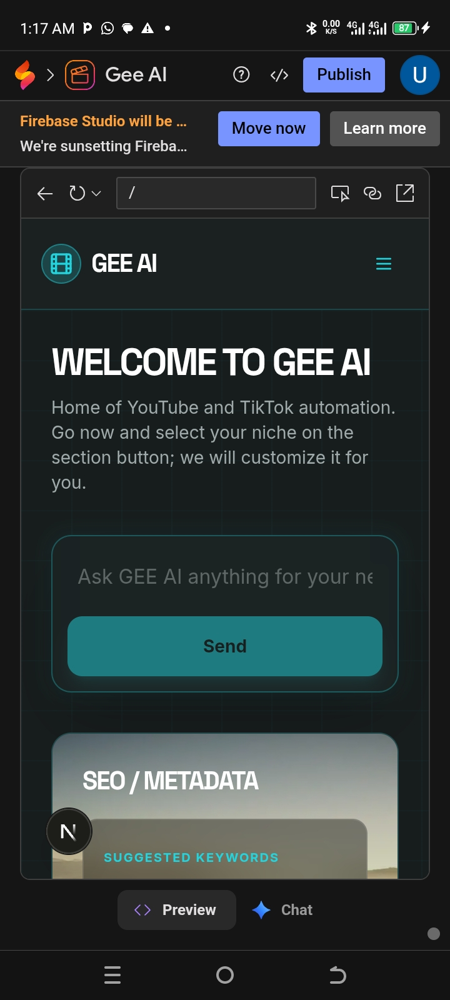

# Chimaobi Michael

**Digital Advertising Specialist | Software Developer**

I bridge the gap between AI-driven software development and high-converting e-commerce strategy. I specialize in "vibe-coding" to build custom AI tools and scaling brands through data-driven advertising.

### 🛠 E-Commerce & Marketing Expertise

* **Shopify Ecosystem**: Full-stack Shopify store setup, dropshipping store automation (Zendrop, Spocket), and digital product integration.
* **Performance Marketing**: Advanced campaign management for Google Ads, Meta Ads (Facebook/Instagram), and TikTok Ads.
* **Growth Strategy**: Traffic arbitrage models and conversion rate optimization.

### 🚀 Projects
S
* **GEE-AI**: An AI content generation suite for automated video and audio creation.

### Firebase backend setup 
i will set and register your app on firebase console 
and i will CREATE and optimize Database for your project 
### Google authenticator login and sign in 
i will create login in and sign  in that your project 
  
